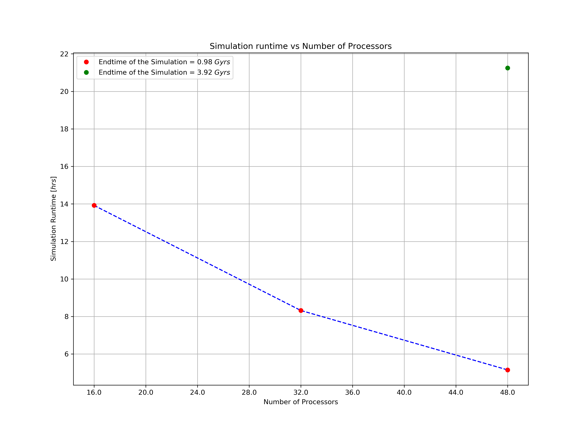
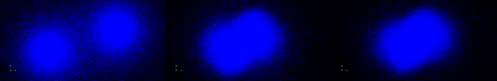
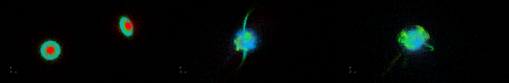
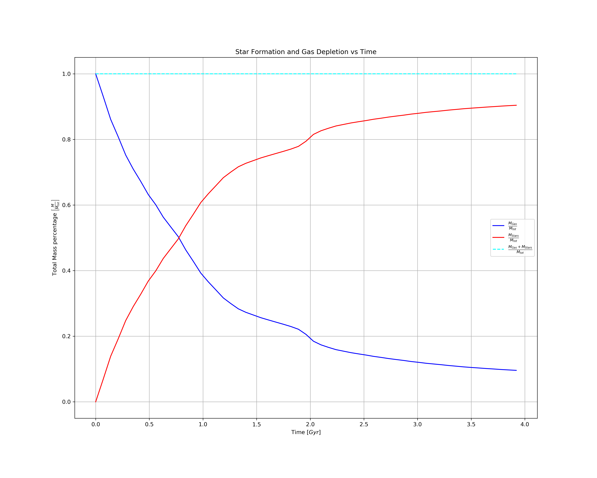
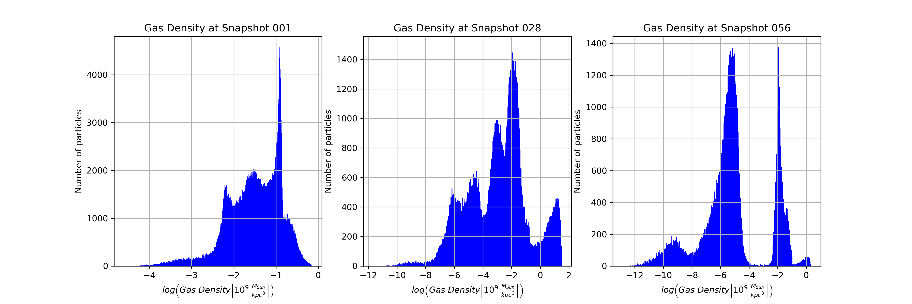

# HPC Galaxy Merger Simulation with Gadget4 🌌
[Leggi in Italiano (IT)](LEGGIMI.md) | [Read in English (EN)](README.md)

[](#)
[](#)
[](#)
[](#)

This project focuses on simulating the collision and merging process of two galaxies using **Gadget4**, a massively parallel code for cosmological N-body/SPH simulations. The simulation accounts for Dark Matter dynamics, gas hydrodynamics, radiative cooling, and star formation.

## 📚 State of the Art & Introduction
Cosmological simulations are the primary tool for studying the large-scale structure and evolution of the universe. Following the **$\Lambda CDM$ model**, Dark Matter (DM) provides the main
gravitational framework for structure formation: it is a **massive** yet **non-interactive** type of matter, a characteristic to which it owes its *"dark"* nature, representing over 85% of the total matter in the universe.  

This project simulates a **Galaxy Merger**, focusing on the interplay between:
- **Dark Matter & Stars:** Modeled as collisionless particles (N-body dynamics).
- **Interstellar Gas:** Modeled using **Smoothed Particle Hydrodynamics (SPH)**.
- **Baryonic Physics:** Including radiative cooling and star formation (SFR).

  <figure>
  <p align="center">
    
  </p>
  <figcaption>
    <p align="center">
      <i> 
        <strong>The Cosmic Web:</strong> The large-scale structure of matter in the universe, formed by gravitational interactions.
      (<a href="https://bigthink.com/hard-science/cosmic-web/"><em>Image Reference</em></a>)
      </i>
    </p>
  </figcaption>
  </figure>

## 💻 HPC & Parallel Computing
The simulation was performed on the **Vera** (Sapienza) and **Leonardo** (CINECA) clusters.
- **HPC Infrastructure:** Leveraging massive parallelization to solve gravitational and hydrodynamical equations for thousands of particles.
- **Environment:** Development required managing dependencies (GSL, FFTW, HDF5) and specific shell environments (e.g., `devtoolset-8`).
- **Strategies:** Gadget4 uses a hybrid **MPI/Shared-Memory Use** approach. Each core is divided in two parts, the first one handles the physical computation through MPI (domain decomposition via TreePM), while the other solely intercedes in the communication requests between nodes (minimizing its latency and eliminating the synchronization losses) through Shared-Memory Use.

  <figure>
  <p align="center">
    
  </p>
  <figcaption>
    <p align="center">
      <i> 
        <strong>Gadget4 Parallelization Scheme.</strong><br>
        (<a href="https://arxiv.org/pdf/2010.03567"><em>Image Reference: Gadget4 Code Paper</em></a>)
      </i>
    </p>
  </figcaption>
</figure>


## 🛠️ Compile & Run the Code

### 1. Environment Setup
Download the [Gadget4](https://wwwmpa.mpa-garching.mpg.de/gadget4/) code, then load the required compiler and libraries:
```bash
scl enable devtoolset-8 bash
# Ensure MPI and HDF5 paths are exported
```

### 2. Compilation
Configure the code via Config.sh and the Makefile (edit the files as needed):
```bash
make
```

$Note_{(1)}$: Ensure that the compiler you use (and only that one) is set in the Makefile by uncommenting it (Default: SYSTYPE="Generic-gcc").  
$Note_{(2)}$: The **Initial Conditions (ICs)** for the simulation are provided by a *.dat* binary file (lagrangian ICs for each particle) and by a *param* text file containing runtime values, tuning parameters and cosmology setup (not relevant for a galaxy merger).

### 3. Execution
Run the simulation using MPI tasks with *N* processors:
```bash
mpirun -np N ./Gadget4 param.txt
```

*Note*: Specify the full paths to the parameters' file *param.txt* and to the mpi library for *mpirun*.

## 💾 Data Pipeline

The project implements a complete data analysis pipeline:

1. **Preprocessing:** A Python-based extraction tool (`Data_Table_Acquirer.ipynb`) converts the binary HDF5 snapshots into structured `.csv` datasets for efficient handling.

2. **Analysis:** Post-processing and Data Analysis are performed in `Data_Analysis.ipynb`. This includes:
   - Evaluating the **star formation rate (SFR)** and subsequent **gas depletion** (incorporating a mass conservation check to verify numerical accuracy),
   - Plotting **gas density histograms**,
   - Assessing **computational efficiency** (measured by elapsed time) as a function of both the number of cores used and total simulation runtime.

*Note - Install dependencies*:
   ```bash
   pip install -r scripts/requirements.txt
   ```

## 📊 Key Results

### 1.  Computational Efficiency & Parallel Scaling

The simulation performance was benchmarked on the HPC cluster to evaluate **Strong Scaling** and execution predictability:

* **Parallel Speedup:** Benchmarks show that the simulation on 16 processors is approximately **1.6x slower** than on 32 processors, and **2.7x slower** than on 48 processors. This demonstrates an effective utilization of the MPI/Shared-Memory hybrid architecture, showing significant performance gains as computational resources increase.
* **Temporal Linearity:** To verify code stability and overhead, a consistency test was performed. Increasing the simulated physical runtime by a factor of 4 (on a fixed 48-processor setup) resulted in a perfectly proportional **4x increase in wall-clock time** (with a negligible uncertainty of $\pm 0.12$ hrs). 
* **Significance:** These results confirm that the Gadget4 implementation on the cluster scales efficiently and maintains a predictable computational cost, which is critical for large-scale astrophysical simulations.

  <figure>
  <p align="center">
    
  </p>
</figure>

### 2.  Morphological Evolution & Visual Analysis
The simulation tracks the dynamic transformation of the system over a timespan of **3.92 Gyrs**, with a temporal resolution of **~69 Myrs** per snapshot (57 snapshots in total). The visual analysis allows us to distinguish between the gravitational scaffold (Dark Matter) and the visible baryonic components.

- **Visual Mapping**
  - **Halo Dynamics:** Representation of the $\color{blue}{\text{Dark Matter Halos}}$ (in $\color{blue}{blue}$) providing the gravitational potential.

  - **Baryonic Components:** Multi-color mapping of the galaxies' structures ($\color{red}{Red\text{: Bulges}}$; $\color{limegreen}{Green\text{: Disks}}$; $\color{cyan}{Cyan\text{: Gas}}$; $\color{yellow}{Yellow\text{: Stars}}$). 

- **Key Evolution Phases:**

  - **Snapshot 1 (Initial State):** The two galaxies are distinct and isolated, beginning their approach.

  - **Snapshot 28 (Merging Phase):** The collision begins. Interaction leads to the formation of prominent tidal tails and arms of baryonic matter.

  - **Snapshot 56 (Merger Remnant):** The core merging process is complete. While the system is in the late stages of dynamical relaxation, the two original galaxies have fused into a single, indistinguishable morphological entity.
 
  <figure>
  <p align="center">
    
  </p>
  <p align="center">
    
  </p>
  </p>
  <figcaption>
    <p>
      <i> 
        $\hspace{32 mm}$ Snapshot 1 $\hspace{62 mm}$ Snapshot 28 $\hspace{62 mm}$ Snapshot 56 <br>
      </i>
    </p>
  </figcaption>
</figure>

### 3.  Star Formation Dynamics, Numerical Conservation & Gas Density Evolution
The simulation accurately tracks the conversion of the gaseous component into stellar mass, governed by the star formation and radiative cooling processes.
- **Star Formation Rate (SFR):** Post-merger analysis shows a rapid initial burst of star formation due to gas compression. The process eventually reaches an **asymptotic plateau**, indicating saturation. This behavior is physically consistent with the absence of **stellar feedback** in the specific configuration, which would otherwise replenish the gas reservoir or regulate formation.
- **Mass Conservation Test:** As a crucial verification of the code's numerical consistency, the total baryonic mass ($M_{gas} + M_{stars}$) was monitored throughout the cosmic time scale. The perfectly constant trend confirms the reliability of the integration and the correct implementation of the conversion algorithms.
  
  <figure>
  <p align="center">
    
  </p>
</figure>

- **Gas Density Evolution:** Gas density histograms in logarithmic scale reveal the transition from diffuse interstellar medium to high-density star-forming regions during the core collision phase.  

<figure>
  <p align="center">
    
  </p>
</figure>

## 🏁 Conclusions
The project demonstrates that Gadget4 is a *powerful* and *highly customizable* tool for cosmological simulations. Key takeaways include:

- **Accuracy:** The code accurately tracks DM and baryonic matter motion, measuring fundamental quantities (density, entropy, internal energy, etc.) over cosmological scales accounting also for the star
formation and cooling function.

- **Physical Insights:** The simulation highlights the crucial role of stellar feedback (or its absence) in replenishing the gas component during the star formation process.

- **Technical Mastery:** This work underscores the vital importance of code optimization and parallelization strategies to achieve high-performance results in scientific computing.

## 📂 Repository Structure

- `config/`: Gadget4 configuration and parameters files.

- `scripts/`: Python tools for data processing and scientific plotting.

- `plots/`: High-resolution renders of the simulation and plots of the data analysis.


---

**Author:** [Corrado Marzano](https://www.linkedin.com/in/corrado-marzano-7846353a8/)  

**Research Context:** Computing Methods for Astrophysics exam @ Sapienza University of Rome
